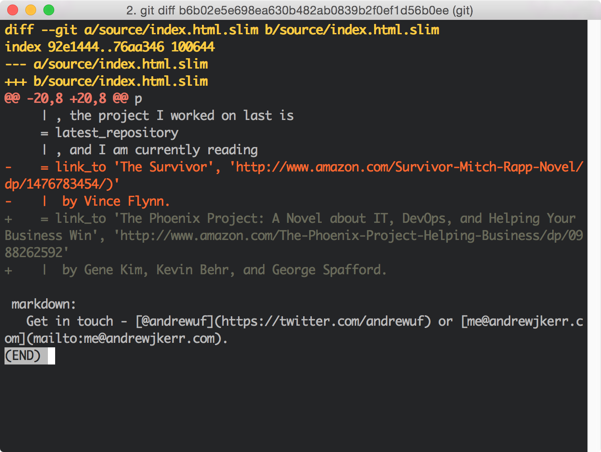
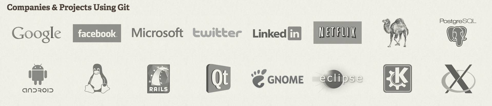

footer: Intro to Git and GitHub | Andrew Kerr
slidenumbers: true

# [fit] Intro to Git and GitHub
## Andrew Kerr
### <me@andrewjkerr.com>

---

## whoami

---

## whoami

- Fifth year Software Engineering @ UF

---

## whoami

- Fifth year Software Engineering @ UF
- Full stack web developer

^ Primarily on Rails; loved security, but liked dev

---

## whoami

- Fifth year Software Engineering @ UF
- Full stack web developer
- Former security intern at Tumblr

---

## whoami

- Fifth year Software Engineering @ UF
- Full stack web developer
- Former security intern at Tumblr
- Former intern at BlockScore

---

# Git

---

> Git is a free and open source distributed version control system designed to handle everything from small to very large projects with speed and efficiency.

---

## Ok, but what's version control?

---

> Version control is a system that records changes to a file or set of files over time so that you can recall specific versions later.

^ What does this look like?

---

^ This is just one change to a file which is tracked

---

## Why learn Git?

^ Well...

---

^ Lots of places use it!

